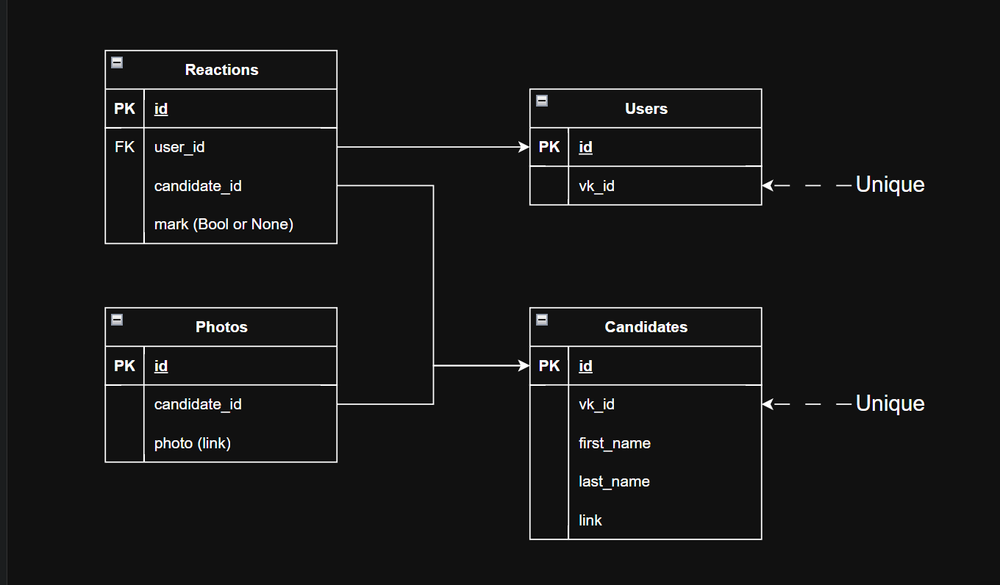

# Командный проект по курсу «Профессиональная работа с Python»: VKinder
Участники команды: Николай Коршунов, Слесарева Ника, Андрей Доценко.

## Задачи бота VKinder
1. Бот определяет информацию (возраст, пол, город), о пользователе, который с ним взаимодействует.
2. Бот ищет подходящих пользователей (далее кандидатов) и вносит их в БД. Критерии поиска: 
   - тот же город (учитывается только, если пользователь указал город в контактах в личных данных)
   - противоположный пол
   - возраст +- 5 лет (учитывается, только если пользователь указал свой день рождения в профиле, иначе поиск осуществляется в диапазоне от 18 до 99 лет)
3. Бот получает три самые популярные фотографии из профиля каждого кандидата и заносит их в БД. 
4. Бот выводит в чат с пользователем информацию о кандидате в формате:
    ```
    - три фотографии,
    - имя и фамилия,
    - ссылка на профиль.
    ```
5. У пользователя есть возможность добавить кандидата в избранные, в черный список, или перейти к следующему кандидату.
6. У пользователя есть возможность в любой момент вывести список избранных кандидатов.
7. Кандидат для показа пользователю выбирается случайным образом из "неотмеченных", т.е. не добавленных ни в черный список, ни в избранные.

## Схема БД:


